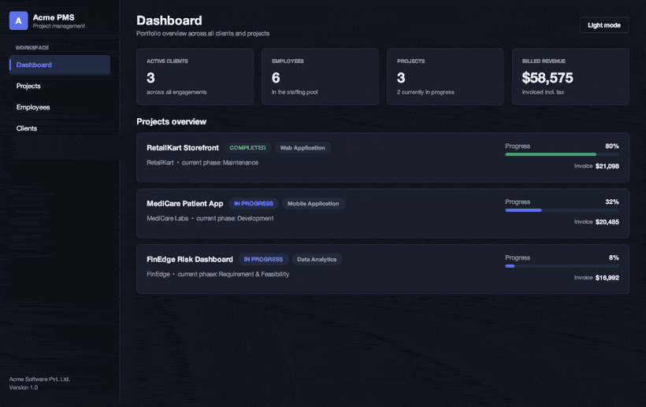
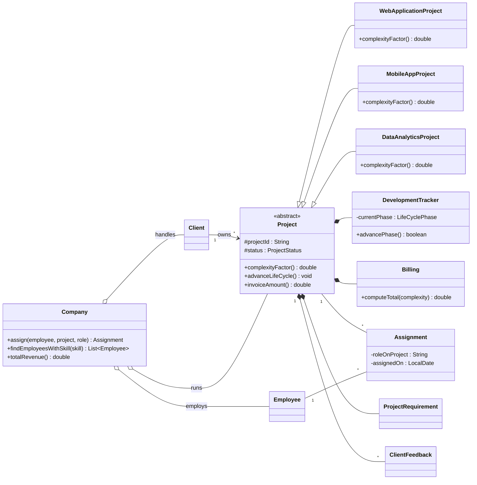

<div align="center">



<br>


**A company runs projects for many clients, and staffs each project with the right people.**<br>
This models that world as objects — then draws it, tests it, and puts a desktop app on top.

**[Read the report (PDF)](docs/Project_Management_System_Report.pdf)**&nbsp; ·&nbsp;
**[Jump to quickstart](#-quickstart)**

<br>



<sub><i>The Swing front end — dashboard, projects, employees and clients, in dark and light appearance.<br>
Every figure is driven by the same domain model the report describes.</i></sub>

</div>

---

## 🎯 The problem

> Design a system, using object-oriented principles, for a company that handles multiple
> clients (projects) and assigns a specific set of employees to manage particular projects.
> Take `Project` as the super class.
>
> <sub>— Software Lab – II (PG/ITE/S/121), Department of Information Technology, Jadavpur University</sub>

Five features were required. Each one became a class with a single responsibility,
rather than one class that knows everything:

| # | Requirement | Class | How it is modelled |
|:-:|-------------|-------|--------------------|
| 1 | Which employee handles which project | `Assignment` | An **association class** — the link carries a role and a date, so it is not a plain association |
| 2 | Project requirement, from a general department | `ProjectRequirement` | Composed into the project; owns the department and its feasibility flag |
| 3 | Development life cycle tracker | `DevelopmentTracker` | Phases live in an `enum`, so they **cannot be visited out of order** |
| 4 | Project billing | `Billing` | `(base + hours × rate) × complexityFactor()` + tax |
| 5 | Client feedback at each stage | `ClientFeedback` | A rating tied to one `LifeCyclePhase`; ratings outside 1–5 are rejected at construction |

---

## 🧬 The design in one diagram

`Project` is abstract. It declares `complexityFactor()`, and every concrete project type
answers it differently — `1.2` for a web application, `1.4` for a mobile app, `1.6` for data
analytics. So `Billing` computes the right invoice **without ever knowing which subclass it is
holding.** That is the polymorphism the whole design turns on.



<sub>Aggregation (◇) where the part outlives the whole — an employee survives the company record.
Composition (◆) where it cannot — a `Billing` has no meaning without its project.
The full diagram, with every attribute and method, is in the report.</sub>

---

## ⚡ Quickstart

No build tool, no libraries. A JDK 11+ is the only thing you need.

```bash
git clone https://github.com/Codewithsayanjib/project-management-system-uml
cd project-management-system-uml
```

**Run the demonstration and the test suite**

```bash
find src -name "*.java" > sources.txt
javac -d out @sources.txt
java -cp out com.pms.app.ProjectManagementDemo
```

**Launch the desktop application**

```bash
./build_app.sh              # builds dist/AcmePMS.jar
java -jar dist/AcmePMS.jar
```

> On Windows, `package_exe.bat` produces a native `.exe` installer via `jpackage`.

---

## ✅ Tests

Fifteen assertions, no external framework — so it runs anywhere `javac` does.

<details>
<summary><b>Show the actual output</b> &nbsp;<code>15 passed, 0 failed</code></summary>

```
  [PASS] Employee.hasSkill finds an existing skill
  [PASS] Employee.hasSkill rejects a missing skill
  [PASS] Assignment appears on the project
  [PASS] Assignment appears on the employee
  [PASS] Project starts NOT_STARTED
  [PASS] Project becomes IN_PROGRESS after first assignment
  [PASS] Tracker starts at REQUIREMENT_FEASIBILITY
  [PASS] Tracker advances to DEVELOPMENT
  [PASS] Project is COMPLETED after full life cycle
  [PASS] Higher complexity yields higher bill
  [PASS] Web invoice equals 1500 * 1.2 = 1800
  [PASS] Feedback rating outside 1..5 is rejected
  [PASS] Average feedback is (4+2)/2 = 3.0
  [PASS] findEmployeesWithSkill returns only matching employees
  [PASS] totalRevenue aggregates all projects
----------------------------------------------------------------------
RESULT: 15 passed, 0 failed, 15 total
```

</details>

Two invariants worth calling out, because they are where object models usually rot:

- **Both ends of an association stay consistent.** Constructing an `Assignment` registers it on
  the employee *and* the project, so the model can never reach a state where one side knows of a
  link the other does not.
- **Invalid data never gets stored.** A feedback rating of `9` throws at construction rather than
  living quietly in a list.

---

## 🗂 Layout

```
src/com/pms/enums/    Designation · LifeCyclePhase · ProjectStatus · SkillLevel
src/com/pms/model/    the domain — Project is the abstract super class
src/com/pms/app/      ProjectManagementDemo (driver) · TestRunner (tests)
src/com/pms/ui/       Swing front end
docs/                 the report
```

<div align="center">
<br>
<sub><b>Sayanjib Sur</b> · Roll 002511002004 · ME-IT, 1st Year (2nd Semester)<br>
Jadavpur University</sub>
</div>
